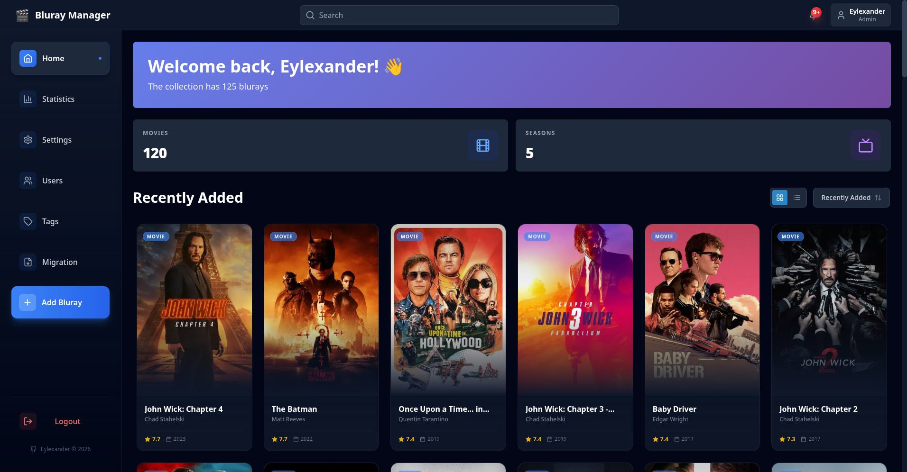
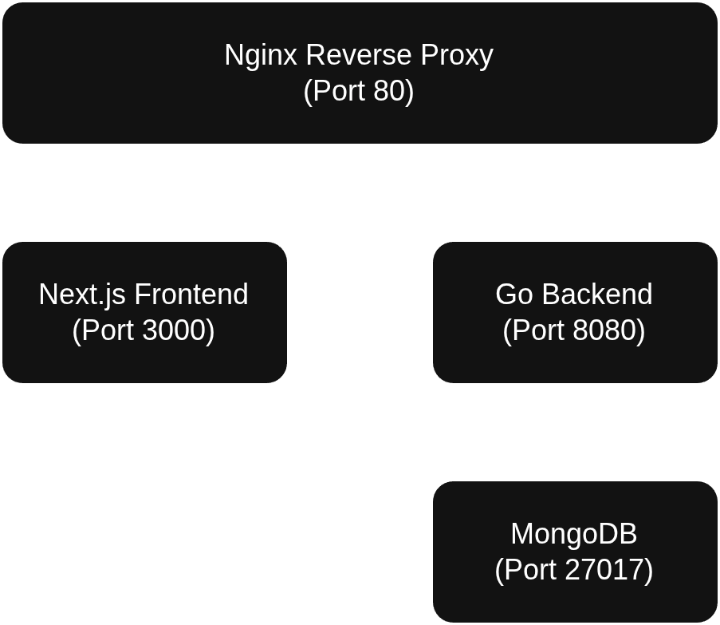

# Bluray Library Manager

A modern web application for managing your personal Bluray collection with a beautiful, Jellyfin-inspired interface. Track movies and TV series, organize with tags, view statistics, and more.



## Features

### Collection Management
- Add, edit, and organize movies and TV series
- Automatic metadata fetching from TMDB (The Movie Database)
- Barcode scanning support for quick item lookup
- Cover images and backdrop artwork
- Purchase price and date tracking
- Custom tagging system for organization

### User System
- Role-based access control (Admin, Moderator, User, Guest)
- User registration and authentication with JWT
- Password reset functionality via email
- Per-user settings and preferences

### Internationalization
- Full support for English (en-US) and French (fr-FR)
- Localized content including movie descriptions and genres
- User-selectable language preferences

### Theme Support
- Light and dark mode
- Persistent theme preferences per user
- Beautiful UI inspired by modern media libraries

### Statistics & Analytics
- Collection overview with total count and value
- Genre distribution charts
- Purchase trends over time
- Most tagged items

### Notifications
- Real-time notifications for collection updates
- Email notifications for important events
- Notification history

## Tech Stack

### Backend
- **Language**: Go 1.24
- **Web Framework**: Gin
- **Database**: MongoDB 7.0
- **Authentication**: JWT with golang-jwt/jwt
- **External APIs**: TMDB integration for metadata

### Frontend
- **Framework**: Next.js 15 (App Router)
- **Language**: TypeScript
- **Styling**: Tailwind CSS
- **State Management**: Zustand
- **Internationalization**: next-intl
- **Theme Management**: next-themes
- **Icons**: Lucide React
- **Charts**: Recharts
- **Animations**: Framer Motion
- **Barcode Scanning**: ZXing

### Infrastructure
- **Containerization**: Docker & Docker Compose
- **Reverse Proxy**: Nginx
- **Development**: Hot-reload with volume mounting

## Architecture



### Project Structure

```
backend/
  ├── api/          # HTTP handlers and routes
  ├── controller/   # Business logic layer
  ├── datastore/    # Database abstraction
  ├── models/       # Data models
  ├── server/       # Server initialization
  └── services/     # External services (email, etc.)

frontend/
  ├── src/
  │   ├── app/          # Next.js app router pages
  │   ├── components/   # React components
  │   ├── hooks/        # Custom React hooks
  │   ├── lib/          # Utilities and API client
  │   ├── store/        # Zustand state management
  │   └── types/        # TypeScript type definitions
  └── messages/         # i18n translation files

docker/
  ├── *.Dockerfile         # Container definitions
  ├── docker-compose.yml   # Development setup
  └── docker-compose.prod.yml  # Production setup
```

## Getting Started

### Prerequisites

- Docker and Docker Compose
- TMDB API key (get one at https://www.themoviedb.org/settings/api)
- (Optional) SMTP credentials for email notifications

### Quick Start with Docker Compose

1. Clone the repository:
```bash
git clone https://github.com/Eylexander/BlurayManager.git
cd BlurayManager
```

2. Create environment file:
```bash
# Create .env file in docker root
cat > ./docker/.env << EOF
TMDB_API_KEY=your_tmdb_api_key_here
JWT_SECRET=your_secure_random_string_here

# Optional: Email configuration
SMTP_HOST=smtp.example.com
SMTP_PORT=587
SMTP_USER=your_email@example.com
SMTP_PASSWORD=your_smtp_password
SMTP_FROM_ADDRESS=noreply@example.com
SMTP_FROM_NAME=Bluray Manager
EOF
```
```bash
# Create .env file in frontend root
cat ./frontend/.env << EOF
NEXT_PUBLIC_API_URL=http://localhost:8080
EOF
```

3. Start the application:
```bash
# Development mode
cd docker
docker-compose up -d

# Production mode
docker-compose -f docker-compose.prod.yml up -d
```

4. Access the application:
- Frontend: http://localhost:3000
- Backend API: http://localhost:8080
- Production (with Nginx): http://localhost

5. Create your first admin user:
Navigate to http://localhost:3000/auth/install for initial setup.

### Building for Production

Use the provided build script:

```bash
# Build both frontend and backend
./build.sh

# Build only backend
./build.sh -backend

# Build only frontend
./build.sh -frontend

# Build with no cache
./build.sh -nc

# Build and push to registry
./build.sh -push
```

## Configuration

### Environment Variables

#### Backend

| Variable | Description | Required | Default |
|----------|-------------|----------|---------|
| `MONGODB_URI` | MongoDB connection string | Yes | - |
| `DB_NAME` | Database name | Yes | `bluray_manager` |
| `JWT_SECRET` | Secret for JWT signing | Yes | - |
| `TMDB_API_KEY` | TMDB API key | Yes | - |
| `PORT` | Server port | No | `8080` |
| `SMTP_HOST` | SMTP server host | No | - |
| `SMTP_PORT` | SMTP server port | No | `587` |
| `SMTP_USER` | SMTP username | No | - |
| `SMTP_PASSWORD` | SMTP password | No | - |
| `SMTP_FROM_ADDRESS` | From email address | No | - |
| `SMTP_FROM_NAME` | From name | No | `Bluray Manager` |

#### Frontend

The frontend uses environment variables at build time. Configure them in your Docker setup or `.env`:

| Variable | Description | Default |
|----------|-------------|---------|
| `NEXT_PUBLIC_API_URL` | Backend API URL | `http://localhost:8080` |

## User Roles

| Role | Permissions |
|------|-------------|
| **Admin** | Full access: manage users, all blurays, settings |
| **Moderator** | Manage all blurays, view users |
| **User** | Manage own blurays, view collection |
| **Guest** | Read-only access to collection |

## Contributing

Contributions are welcome! Please follow these steps:

1. Fork the repository
2. Create a feature branch (`git checkout -b feature/amazing-feature`)
3. Commit your changes (`git commit -m 'Add amazing feature'`)
4. Push to the branch (`git push origin feature/amazing-feature`)
5. Open a Pull Request

### Development Guidelines

- Follow Go conventions for backend code
- Use TypeScript strict mode for frontend
- Write meaningful commit messages
- Add tests for new features
- Update documentation as needed

## License

This project is open source and available under the [Eclipse Public License 2.0](LICENSE).

## Acknowledgments

- UI design inspired by [Jellyfin](https://jellyfin.org/)
- Movie metadata provided by [The Movie Database (TMDB)](https://www.themoviedb.org/)
- Icons from [Lucide](https://lucide.dev/)

## Support

For issues, questions, or contributions, please visit the [GitHub repository](https://github.com/Eylexander/BlurayManager).
